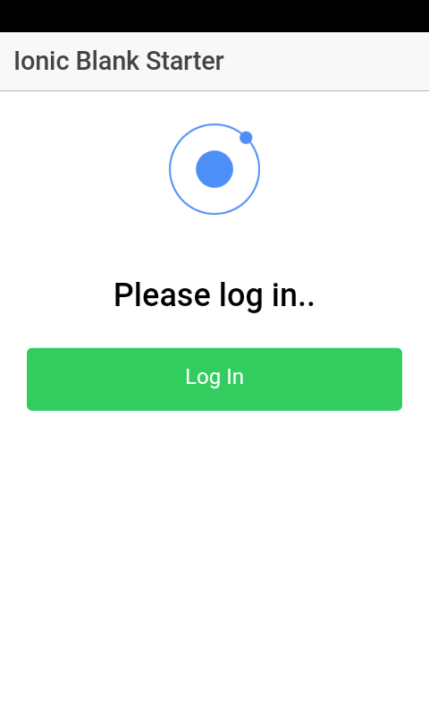
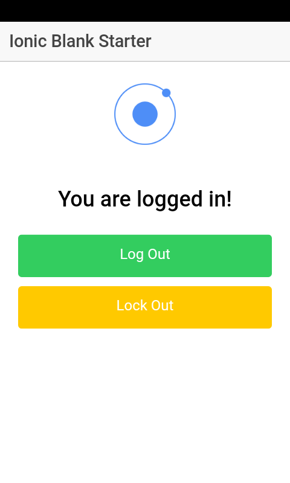

# Ionicv1 IV Demo App

A basic blank demo app with single view for using AngularJS IV service (userservice.js).

The app code shows the use of service APIs to login, logout or lock the user credentials.

# Usage

1. Checkout the app
2. Install the dependencies (npm install)
3. Add cordova platform support
4. Install the ionic-native-auth-plugin (IV). 
5. Prepare and run the app (ionic cordova run android)

# Screens

  <table><tr>
    <td style="text-align: center">
        
         
        Initial Login Screen
    </td>
    <td style="text-align: center">
        
         
        After Logging In
    </td>
    <td style="text-align: center">
        
         
        Login with Biometrics
    </td>
  </tr></table>

